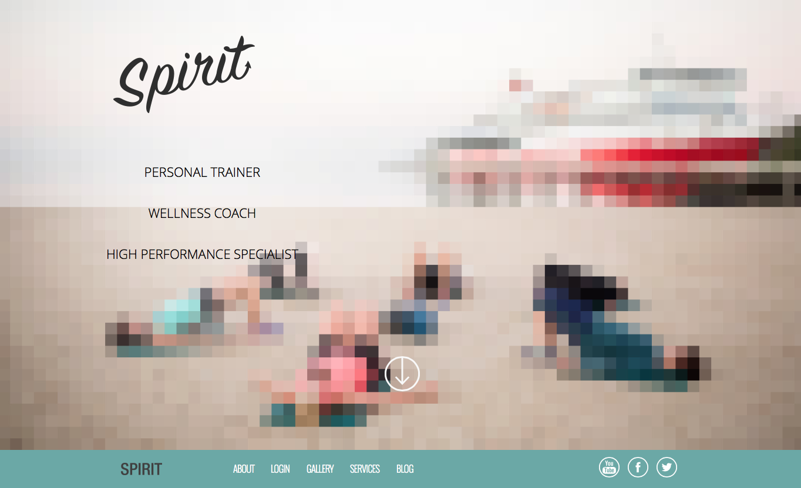
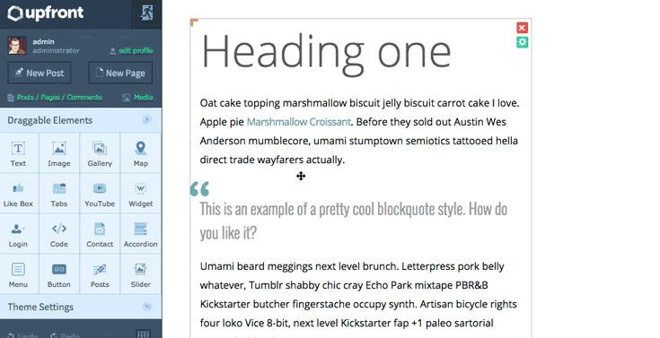

# Upfront Part 1: The Basics, Theme Colors and Typography

Mit Upfront können Sie das Design Ihrer Website so einfach anpassen, dass Sie nie wieder ein WordPress-Theme benötigen.
Dank des leistungsstarken und intuitiven Designs der Theme-Plattform können Sie den gesamten Inhalt Ihrer Website per Drag-and-Drop im Front-End bearbeiten und bearbeiten. Das Erstellen einer Website nimmt überhaupt keine Zeit in Anspruch. Es ist wirklich so einfach.
In dieser siebenteiligen Serie, die die Verwendung von Upfront vorstellt, zeige ich Ihnen, wie Sie ein vorhandenes Upfront-Theme – in diesem Fall Spirit – in eine völlig andere Website umwandeln, komplett mit eigenem Branding, Bildern, benutzerdefinierten Schriftarten usw responsives Layout.

## Im Verlauf dieser Serie zeigen wir Ihnen anhand zahlreicher Beispiele, wie Sie Upfront nutzen:

- **Part 1:** [The Basics, Theme Colors and Typography](https://cp-psource.github.io/upfront/tutorial-basics.html)
- **Part 2:** [Structuring Your Site with Regions](https://cp-psource.github.io/upfront/tutorial-regions.html)
- **Part 3:** [Laying Out Your Site with Elements](https://cp-psource.github.io/upfront/tutorial-elements.html)
- **Part 4:** [Tweaking Elements and Custom Code](https://cp-psource.github.io/upfront/tutorial-tweaking.html)
- **Part 5:** [Adding Plugins and Styling Gravity Forms](https://cp-psource.github.io/upfront/tutorial-plugins.html)
- **Part 6:** [Creating Responsive Websites](https://cp-psource.github.io/upfront/tutorial-responsive.html)
- **Part 7:** [Working with Pages and Posts](https://cp-psource.github.io/upfront/tutorial-content.html)

Wir werden das Spirit-Thema aufgreifen und seine Regionen, Inhalte, Typografie und andere Elemente komplett überarbeiten und Folgendes umwandeln:

Darin ein Produktthema, komplett mit eigenem Branding, Farben, Typografie, Schaltflächen, Bildern, Kontaktformular und anderen Elementen:

## Lass uns anfangen.

Installation von Upfront und Spirit
Als Erstes müssen Sie Upfront und Spirit installieren. Sie können dies tun, indem Sie das WPMU DEV Dashboard herunterladen. Nach der Installation aktivieren Sie es im Backend Ihrer Website. Anschließend können Sie sich bei Ihrem WPMU DEV-Konto anmelden. Navigieren Sie zu „Themes“, klicken Sie auf Spirit und installieren Sie es.

Sie müssen Upfront nicht separat herunterladen, da es automatisch mit allen unseren neuen Themes installiert wird, wenn Sie das Dashboard-Plugin verwenden.

Wenn Sie Upfront und Spirit bereits installiert haben, stellen Sie sicher, dass Sie über die neuesten Versionen verfügen. Dies ist wichtig, da sich Upfront noch in der Entwicklung befindet und regelmäßig neue Versionen veröffentlicht werden.

Gehen Sie als Nächstes zu „Darstellung“ > „Themen“ und aktivieren Sie „Spirit“.

Bearbeiten in Upfront
Bearbeiten in Upfront.
Es ist wichtig, Pretty Permalinks zu aktivieren. Gehen Sie zu Einstellungen > Permalinks und aktivieren Sie das Optionsfeld neben „Beitragsname“.

Jetzt können Sie mit der Bearbeitung Ihrer Website beginnen. Klicken Sie in der Admin-Leiste oben auf der Seite auf „Upfront“.

Löschen, Ändern der Größe und Verschieben
Beginnen wir mit dem Löschen von Dingen.

Sie müssen lediglich mit der Maus über ein Element fahren und auf das rote „x“ klicken, das oben rechts angezeigt wird.

Die Größenänderung ist genauso einfach. Lassen Sie uns die Größe desselben Elements ändern. Bewegen Sie den Mauszeiger darüber, klicken Sie auf den orangefarbenen Griff und ziehen Sie ihn auf die gewünschte Größe.

Wenn Sie ein Element, beispielsweise einen Text oder ein Bild, verschieben möchten, bewegen Sie den Mauszeiger darüber und klicken und ziehen Sie.

Hinweis: Wenn Sie sich fragen, warum Sie die Größe des „Spirit“-Logos nicht ändern können, liegt das daran, dass es sich um ein Standardbild handelt, das mit diesem speziellen Design geliefert wird. Sie können gerne Ihr eigenes Logo hochladen oder es einfach löschen.

Größe ändern, ziehen, löschen
Themenfarben
Haben Sie schon einmal ein tolles Thema für Ihre Website gefunden und das Layout gefiel Ihnen, aber die Farben gefielen Ihnen einfach nicht?

Mit Upfront können Sie alle Ihre Theme-Farben von einem zentralen Ort aus steuern und ersparen sich so den Aufwand, die Farben einzelner Elemente jedes Mal zu ändern, wenn Sie Ihre Meinung ändern. Das bedeutet, dass Sie die Farben steuern können – und die Konsistenz auf Ihrer gesamten Website aufrechterhalten – für Dinge wie Text, Rahmen, Hintergründe, Farben … alles! Es ist wie eine Farbpalette für Ihre Website.

Wenn Sie zu den Designeinstellungen gehen und dann auf „Farben“ klicken, werden Sie sehen, dass Spirit sechs Designfarben zugewiesen wurden.

Das Theme, das ich erstelle, hat Markenfarben. Ich muss also nur auf jede Standardfarbe klicken, meinen Hexadezimalcode eingeben (oder eine Farbe aus der Farbauswahl auswählen) und auf „OK“ klicken. Jedes Element in meinem Theme wird automatisch auf die entsprechenden Farben aktualisiert.

Schauen Sie sich das GIF unten an, um zu sehen, wie das alles funktioniert. Wenn Sie Upfront installiert haben, können Sie die Designeinstellungen selbst ausprobieren (oder versuchen, die Spirit-Demoseite anzupassen).

Text bearbeiten
Das Bearbeiten von Text in Upfront ist einfach. Sie müssen lediglich auf einen Textbereich doppelklicken. Wenn Sie erneut doppelklicken, um ein Wort auszuwählen (oder dreimal klicken, um einen Absatz auszuwählen), wird die Textbearbeitungssymbolleiste eingeblendet, die Ihnen die folgenden Optionen bietet :

Typelement – Dazu gehören H1, H2, H3, H4, H5, H6, P und das Codeformat
Fett – Machen Sie den Text fett
Kursivschrift – Schreiben Sie Ihren Text kursiv
Ausrichtung – Links, Mitte und rechts richten Ihren Text aus bzw. im Blocksatz
Liste – Erstellen Sie eine Liste mit Aufzählungszeichen oder Nummern
Blockquote – Erstellen Sie ein Blockquote
Link – Verlinken Sie Text mit einer URL, einem Beitrag oder einer Seite, einem Anker oder einem Lightbox-Element
Inline-Symbole – Fügen Sie ein Symbol ein
Textbearbeitung
Textbearbeitung in Upfront.
Die Textbearbeitungssymbolleiste enthält Symbole, die Sie beliebig vergrößern oder verkleinern und deren vertikale Ausrichtung anpassen können.

Wenn Sie mit der Verwendung der Symbolleiste fertig sind, klicken Sie einfach an eine andere Stelle auf der Seite und die Symbolleiste wird ausgeblendet.

Typografie
Mit Upfront können Sie Ihre Schriftarten von einem einfachen Ort in der Seitenleiste aus verwalten. Gehen Sie einfach zu den Designeinstellungen und klicken Sie dann auf Typografie.

Für jedes Typelement können Sie Schriftart, Stärke/Stil, Farbe, Größe und Zeilenhöhe angeben.

Sie können auch benutzerdefinierte CSS-Regeln hinzufügen, aber wir werden uns später in einem anderen Beitrag dieser Serie damit befassen.

Mit dem Theme Fonts Manager können Sie Ihrem Theme beliebige Google-Schriftarten hinzufügen. Klicken Sie einfach auf „Themenschriftarten-Manager“ und wählen Sie eine Google-Schriftart aus. Klicken Sie dann auf „Hinzufügen“, um sie zu Ihrer Liste der Themenschriftarten hinzuzufügen. Sie können dann im Schriftart-Dropdown-Menü auf diese Schriftart zugreifen, etwa so:

Konsistente Typografie
Der beste Weg, Ihren Text, einschließlich Ihrer Überschriften und Absatztexte, zu formatieren, besteht darin, alles auf einmal zu erledigen. Der einfachste Weg, dies zu tun, besteht darin, Ihrer Website Beispieltext hinzuzufügen, ihn in den Designeinstellungen zu formatieren und ihn dann zu löschen.

So machen Sie es:

Kopieren Sie den Beispieltext, den wir bei CodePen hochgeladen haben, und stellen Sie sicher, dass die Formatierung erhalten bleibt
Fügen Sie den Text in ein beliebiges Textelement in Upfront ein
Gehen Sie zu den Designeinstellungen und wählen Sie Typografie aus, falls diese noch nicht geöffnet ist
Wählen Sie für jedes Schriftelement Schriftart, Stärke/Stil, Farbe, Größe und Zeilenhöhe
Der Beispieltext wird bei jeder Auswahl automatisch aktualisiert, sodass Sie alle Ihre Änderungen auf einmal sehen können. Aus gestalterischer Sicht können Sie so schnell erkennen, ob Ihre Schriftarten- und Farbauswahl für verschiedene Schriftelemente übereinstimmen.

Das obige GIF veranschaulicht, wie Sie Änderungen an Ihrer Typografie in einer Live-Vorschau anzeigen können, wenn Sie Aktualisierungen in den Designeinstellungen vornehmen.

Abschluss
Lassen Sie uns noch einmal zusammenfassen, was wir bisher bei der Zusammenstellung unserer neuen Website erreicht haben:

Wir haben herausgefunden, wie Sie Elemente wie Bilder und Textbereiche löschen, verschieben und in der Größe ändern können
Alle Themenfarben wurden aktualisiert, um dem Branding unserer neuen Website zu entsprechen
Wir haben alle Schriftelemente (H1, H2, P usw.) mit neuen Schriftarten und -größen aktualisiert
Wir haben auch benutzerdefinierte Schriftarten hinzugefügt
Im nächsten Beitrag dieser Reihe werden wir weiter an unserer neuen Website arbeiten und uns dieses Mal darauf konzentrieren, wie man mithilfe von Regionen ein benutzerdefiniertes Layout erstellt, das sich von Spirit unterscheidet.

Lesen Sie den nächsten Beitrag in dieser Reihe: Teil 2: Strukturieren Sie Ihre Website mit Regionen

Wenn Sie Fragen zu dem haben, was wir in diesem Beitrag behandelt haben, können Sie uns diese gerne in den Kommentaren unten stellen.

So verwenden Sie Upfront-Serien:
- **Part 1:** [The Basics, Theme Colors and Typography](https://cp-psource.github.io/upfront/tutorial-basics.html)
- **Part 2:** [Structuring Your Site with Regions](https://cp-psource.github.io/upfront/tutorial-regions.html)
- **Part 3:** [Laying Out Your Site with Elements](https://cp-psource.github.io/upfront/tutorial-elements.html)
- **Part 4:** [Tweaking Elements and Custom Code](https://cp-psource.github.io/upfront/tutorial-tweaking.html)
- **Part 5:** [Adding Plugins and Styling Gravity Forms](https://cp-psource.github.io/upfront/tutorial-plugins.html)
- **Part 6:** [Creating Responsive Websites](https://cp-psource.github.io/upfront/tutorial-responsive.html)
- **Part 7:** [Working with Pages and Posts](https://cp-psource.github.io/upfront/tutorial-content.html)