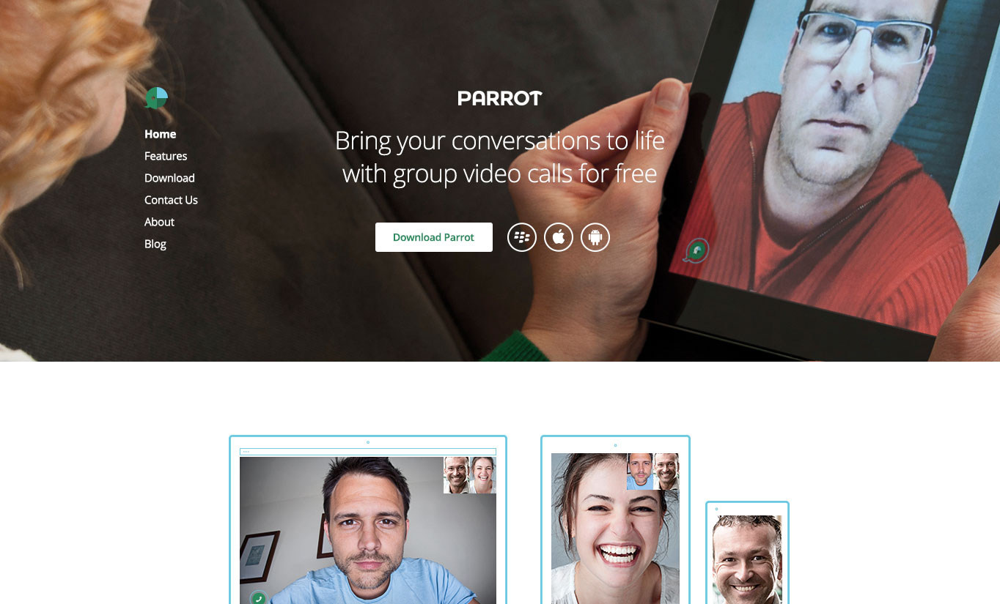

# Upfront Part 1: The Basics, Theme Colors and Typography

## Upfront makes customizing the design of your site so easy you’ll never need another WordPress theme.

Thanks to the theme platform’s powerful and intuitive design, you can drag-and-drop and edit all of your site’s content on the front-end. Creating a site takes no time at all. It really is that simple.

In this seven-part series introducing how to use Upfront, I’ll show you how to take an existing Upfront theme – in this case Spirit – and turn it into a completely different site, complete with its own branding, images, custom fonts and responsive layout.

### Over the course of this series we will use lots of examples to show you how to use Upfront:

- **Part 1:** [The Basics, Theme Colors and Typography](https://cp-psource.github.io/upfront/tutorial-basics.html)
- **Part 2:** [Structuring Your Site with Regions](https://cp-psource.github.io/upfront/tutorial-regions.html)
- **Part 3:** [Laying Out Your Site with Elements](https://cp-psource.github.io/upfront/tutorial-elements.html)
- **Part 4:** [Tweaking Elements and Custom Code](https://cp-psource.github.io/upfront/tutorial-tweaking.html)
- **Part 5:** [Adding Plugins and Styling Gravity Forms](https://cp-psource.github.io/upfront/tutorial-plugins.html)
- **Part 6:** [Creating Responsive Websites](https://cp-psource.github.io/upfront/tutorial-responsive.html)
- **Part 7:** [Working with Pages and Posts](https://cp-psource.github.io/upfront/tutorial-content.html)

We’ll be taking the Spirit theme and completely reworking its regions, content, typography and other elements, turning this:

Into this, a product theme, complete with its own branding, colors, typography, buttons, images, contact form and other elements:

* Let’s get started.

## Installing Upfront and Spirit

First thing’s first, you need to install Upfront and [Spirit](https://github.com/cp-psource/uf-spirit). Once installed, activate it in the backend of your site. Navigate to “Themes,” click Spirit and install it.

If you already have Upfront and Spirit installed, make sure you have the latest versions. This is important as Upfront is still under development and new versions are being regularly released.

Next, go to **Appearance > Themes** and activate Spirit.

* Editing in Upfront.

It’s important to enable Pretty Permalinks. Go to **Settings > Permalinks** and check the radio button next to “Post Name.”

Now you’re ready to start editing your site. In the admin bar at the top of the page, click on “Upfront.”

### Deleting, Resizing and Moving

Let’s start with deleting stuff.

All you need to do is hover over an element and click the red “x” that appears in the top-right.

Resizing is just as easy. Let’s resize the same element. Hover over it, click the orange handle and drag it to your desired size.

If you want to move an element, such as text or an image, hover over it and click and drag.

Note: If you’re wondering why you can’t resize the “Spirit” logo, it’s because it’s a default image that comes with this particular theme. Feel free to upload your own logo or just delete it.

### Theme Colors

Have you ever found a great theme for your site and loved the layout, but just didn’t like the colors?

Upfront allows you to control all of your theme colors from one central location, saving you the hassle of changing the colors of individual elements every time you change your mind. This means you can control the colors – and maintain consistency across your site – for things like text, borders, backgrounds, colors… everything! It’s like a color palette for your site.

If you go to **Theme Settings** and then click on **Colors**, you’ll see that Spirit has been assigned six theme colors.

The theme I’m building has branded colors, so all I need to do is click on each default color, enter my hexadecimal code (or choose a color from the color picker) and click OK. Each of the elements in my theme will automatically update to the corresponding colors.

Check out the GIF below to see how it all works. If you have Upfront installed, why not go have and have a play with the theme settings yourself.

Make sure you hit Save when you’re done.

Editing Text
Editing text in Upfront is simple. All you need to do is double-click on a text area, and if you double-click again to select a word (or triple-click to select a paragraph), the text editing toolbar will pop-up, giving you the following options:

- Type Element – This includes H1, H2, H3, H4, H5, H6, P and code format
- Bold – Make text bold
- Italics – Italicize your text
- Alignment – Left, center and right align or justify your text
- List – Create a bulleted or numbered list
- Blockquote – Create a blockquote
- Link – Link text to a URL, post or page, anchor or a lightbox element
- Inline Icons – Insert an icon

* Text Editing in Upfront.

The text editing toolbar includes icons, which you can make it as big or as small as you like, as well as adjust their vertical alignment.

When you’re done using the toolbar, just click elsewhere on the page and the toolbar will disappear.

### Typography

Upfront allows you to manage your fonts all from one easy location in the sidebar. Just go to **Theme Settings**, and then click on **Typography**.

For each type element, you can specify its typeface, weight/style, color, size, and line height.

You can also add custom CSS rules, but we’ll look at that later as part of another post in this series.

The Theme Fonts Manager allows you to add any Google font to your theme. Simply click on **Theme Fonts Manager** and select a Google font, then click **Add** to add it to your theme font styles list. You can then access that font in the typeface dropdown menu, like so:

### Consistent Typography

The best way to style your text, including your headers and paragraph text, is to do it all in one go. The easiest way to do this is to add sample text to your site, style it in the Theme Settings, and then delete it.

Here’s how you do it:

-Copy the [sample text we’ve uploaded over at CodePen](https://codepen.io/Dernerd/pen/XWwqZep) and make sure the formatting remains intact
-Paste the text into any text element in Upfront
-Go to Theme Settings and select Typography if it isn’t already open
-For each type element, choose a typeface, weight/style, color, size and line height

The sample text will auto-update as you make each selection, allowing you to see all of your changes in one go. From a design point of view, this allows you to quickly see whether your font and color choices for different type elements match.

The GIF above illustrates how you can live preview changes to your typography when you make updates in the Theme Settings.

## Conclusion

So let’s recap what we’ve accomplished so far in putting together our new site:

- We’ve worked out how to delete, move and resize elements like images and text areas
- All theme colors have been updated to match the branding for our new site
- We’ve updated all the type elements (H1, H2, P, etc) with new typefaces and sizes
- We’ve also added custom fonts

In the next post in this series, we’ll continue working on our new site, this time focusing on how to use regions to create a custom layout different from Spirit.

Read the next post in this series: **Part 2:** [Structuring Your Site with Regions](https://cp-psource.github.io/upfront/tutorial-regions.html)

### How to Use Upfront Series:

- **Part 1:** [The Basics, Theme Colors and Typography](https://cp-psource.github.io/upfront/tutorial-basics.html)
- **Part 2:** [Structuring Your Site with Regions](https://cp-psource.github.io/upfront/tutorial-regions.html)
- **Part 3:** [Laying Out Your Site with Elements](https://cp-psource.github.io/upfront/tutorial-elements.html)
- **Part 4:** [Tweaking Elements and Custom Code](https://cp-psource.github.io/upfront/tutorial-tweaking.html)
- **Part 5:** [Adding Plugins and Styling Gravity Forms](https://cp-psource.github.io/upfront/tutorial-plugins.html)
- **Part 6:** [Creating Responsive Websites](https://cp-psource.github.io/upfront/tutorial-responsive.html)
- **Part 7:** [Working with Pages and Posts](https://cp-psource.github.io/upfront/tutorial-content.html)