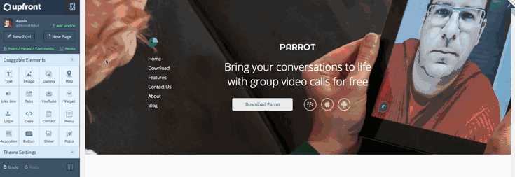
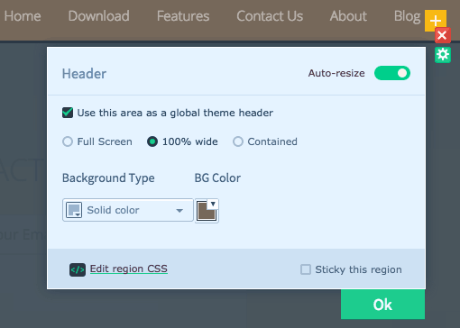

# Upfront Part 7: Working With Pages and Posts

Whether you want to add a detailed products and services page to your business portfolio or just need to write up a quick blog post, Upfront provides a powerful yet intuitive platform for quickly creating pages and posts in the front-end of your site.
With Upfront, you can even style pages and posts how you like and your content will still be there when you switch themes, free of unwanted shortcodes and messy formatting.

In today’s post, the last in our series introducing how to use Upfront, I’ll show you how simple it is to create pages and posts.

As part of this series, we’re adapting an existing Upfront theme – in this case Spirit – and turning it into a completely different site, complete with its own branding, images, custom fonts and responsive layout.

### Over the course of this series we will use lots of examples to show you how to use Upfront:

- **Part 1:** [The Basics, Theme Colors and Typography](https://cp-psource.github.io/upfront/tutorial-basics.html)
- **Part 2:** [Structuring Your Site with Regions](https://cp-psource.github.io/upfront/tutorial-regions.html)
- **Part 3:** [Laying Out Your Site with Elements](https://cp-psource.github.io/upfront/tutorial-elements.html)
- **Part 4:** [Tweaking Elements and Custom Code](https://cp-psource.github.io/upfront/tutorial-tweaking.html)
- **Part 5:** [Adding Plugins and Styling Gravity Forms](https://cp-psource.github.io/upfront/tutorial-plugins.html)
- **Part 6:** [Creating Responsive Websites](https://cp-psource.github.io/upfront/tutorial-responsive.html)
- **Part 7:** [Working with Pages and Posts](https://cp-psource.github.io/upfront/tutorial-content.html)

We’re taking the Spirit theme and completely reworking its regions and content, and turning it into a product theme, complete with its own branding, colors, buttons, images, typography, newsletter subscribe form and other elements.

In this series we’ve updated theme colors, added custom fonts, deleted regions, updated the header image, added a full width video region, created and styled a newsletter subscribe form using Gravity Forms, and updated the responsive layout for mobile devices.

## Creating a New Post

To create a post, all you need to do is click “New Post” in the left sidebar. The Upfront post editor will load, allowing you to add text and images to your post (just double-click on the text areas), but not any Upfront elements (we’ll get to that soon).

If the right-hand sidebar looks familiar it’s because it’s almost identical to the publishing options in WordPress post editor. The sidebar allows you to save a draft, preview your post and also update the post status, visibility, and publication date. Importantly, the sidebar is where you can hit “Publish” and share your post with the world.

At the bottom of the sidebar there are further options for adding categories and tags, and you can update the URL as well.

When you click “Publish,” your content will be saved and published and the usual Upfront sidebar will reappear on the left.

If you hit “Cancel,” you’ll also be returned to the Upfront editor. Don’t forget to save your draft otherwise you’ll lose your content.

## Creating a New Page

Creating a page is almost identical to how you would create a new post. The only difference is that when you click “New Page” in the left-hand sidebar, you’re prompted to give your page a name and choose a page template.

When you click “Create Page,” you’ll be taken to the page editor where you can add text and images to your page, as well as elements.

It’s important to note that if you choose not to use a page template, you won’t be able to add any elements to the page (we’ll also get to that shortly).

### Pre-Made Template Versus No Template

Upfront works on a paradigm based on layouts, which allows you to create complex pages for your site and still have access to your content when you switch themes. This means that you’ll never be locked in to using Upfront or have to waste time stripping shortcodes out of your pages if you decide to changes themes.

It is important, however, that you choose the right template when creating a new page if you decide later on that you would like to use another theme.

When you create a new page that doesn’t use a templates, i.e. you select “None” in the “Page Template” dropdown box, you’re basically creating a standard WordPress page. The only difference is that your content is saved as a new element. This means that when you save or publish your new page and switch to the Upfront editor, you will be able to move your text and/or words around like any other element. In order to edit your page content, just double-click it and you’ll return to the page editor.

On the other hand, when you choose to use a pre-made template, your content becomes part of the layout and is not saved to your site’s database. This means that if you switch to using another theme, say Twenty Fifteen, you won’t be able to access your content. However, if you reactivate the theme, the content will also be reactivated so you’ll never lose it.

### Adding Upfront Elements to Pages and Posts

When you save or publish a page or post, you’ll return to the Upfront editor where you can access elements. This means you can add new elements to your post or page, or move, resize, or delete your content (as it’s now treated as an element).

* Using a global header.

Currently, Upfront provides users with the means to create global header and footer regions. In Spirit, the global header is the navigation bar, and the footer is, well, the footer.

By altering any aspect of a region that is defined as a global region, the rest of the pages that use that region will also be updated to use the region with your modifications.

This is very handy as most pages across your site are likely to have global headers and footers. This means you will only have to update these in one place.

In the Spirit theme, the homepage does not use a global header. Instead, we have a “hero” region, followed by the navigation region. All other pages in Spirit use a global navigation header. This means that if you wanted to update those to a different design, you would have to manually update the navigation region on the homepage, and then modify it on any of the pages that Spirit provides (where it is defined as a global region).

It’s worth pointing out that we are already working on a feature that will allow users to create multiple global regions (not just header and footer) and load them anywhere on your site. This feature will be shipping pretty soon, so watch this space.

### Accessing Posts and Pages

In order to access your full lists of posts and pages, click **Posts / Pages / Comments** in the left sidebar. An overlay will appear where you can choose to edit, view or trash your content. Just click on the “Posts” and “Pages” tabs at the top to switch between the two.

## Conclusion

In this post we’ve learned how simple it is to create pages and posts in Upfront.

This is the final post in our series on how to use our theme platform. Over seven posts we’ve adapted the Spirit theme and turned it into a fully responsive one-pager site for a product. Along the way, we’ve updated typography, added images and full width video, as well as created and style a Gravity Forms newsletter subscribe form.

I hope you’ve found this series helpful! Upfront really does make customizing the design of your site so easy you’ll never need another WordPress theme.

Read the first post in this series: **Part 1:** [The Basics, Theme Colors and Typography](https://cp-psource.github.io/upfront/tutorial-basics.html)

### How to Use Upfront Series:

- **Part 1:** [The Basics, Theme Colors and Typography](https://cp-psource.github.io/upfront/tutorial-basics.html)
- **Part 2:** [Structuring Your Site with Regions](https://cp-psource.github.io/upfront/tutorial-regions.html)
- **Part 3:** [Laying Out Your Site with Elements](https://cp-psource.github.io/upfront/tutorial-elements.html)
- **Part 4:** [Tweaking Elements and Custom Code](https://cp-psource.github.io/upfront/tutorial-tweaking.html)
- **Part 5:** [Adding Plugins and Styling Gravity Forms](https://cp-psource.github.io/upfront/tutorial-plugins.html)
- **Part 6:** [Creating Responsive Websites](https://cp-psource.github.io/upfront/tutorial-responsive.html)
- **Part 7:** [Working with Pages and Posts](https://cp-psource.github.io/upfront/tutorial-content.html)