# Upfront Part 3: Laying Out Your Site with Elements

From images and text to galleries, maps and buttons, Upfront allows you to drag and drop elements anywhere on your site.
While regions provide the building blocks needed to structure your site, elements supply the core functionality. All up there are 16 available elements that allow you to create everything from basic text areas to more advanced custom coded solutions.

In today’s post we’ll take a look at each of the elements, how they work, and explore their settings.

This is the third post in our series introducing how to use Upfront. We’re adapting an existing Upfront theme – in this case Spirit – and turning it into a completely different site, complete with its own branding, images, custom fonts and responsive layout.

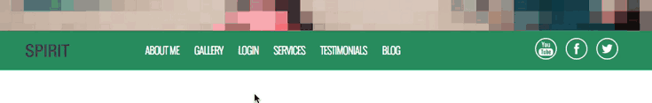

### Over the course of this series we will use lots of examples to show you how to use Upfront:

- **Part 1:** [The Basics, Theme Colors and Typography](https://cp-psource.github.io/upfront/tutorial-basics.html)
- **Part 2:** [Structuring Your Site with Regions](https://cp-psource.github.io/upfront/tutorial-regions.html)
- **Part 3:** [Laying Out Your Site with Elements](https://cp-psource.github.io/upfront/tutorial-elements.html)
- **Part 4:** [Tweaking Elements and Custom Code](https://cp-psource.github.io/upfront/tutorial-tweaking.html)
- **Part 5:** [Adding Plugins and Styling Gravity Forms](https://cp-psource.github.io/upfront/tutorial-plugins.html)
- **Part 6:** [Creating Responsive Websites](https://cp-psource.github.io/upfront/tutorial-responsive.html)
- **Part 7:** [Working with Pages and Posts](https://cp-psource.github.io/upfront/tutorial-content.html)

We’re taking the Spirit theme and completely reworking its regions and content, and turning it into a product theme, complete with its own branding, colors, buttons, images, typography, newsletter subscribe form and other elements.

So far in this series, we’ve updated theme colors, added custom fonts, deleted regions, updated the header image and added a full width video region. Here’s a look at our progress so far:

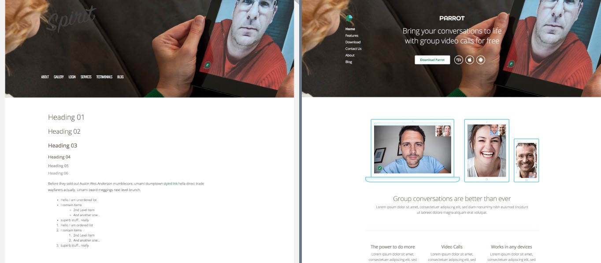
On the left, our progress. On the right, what we’re working towards building.

## Upfront Elements

### Text

The text element allows you to create a new text area anywhere on your site. Once created, just double-click and enter your text.

You can find out more about styling text and using the text editing toolbar in [Upfront: The Basics, Theme Colors and Typography](https://cp-psource.github.io/upfront/tutorial-basics.html).

### Image

Add an image to your site. Just drag-and-drop the element where you would like to display an image. The element box will prompt you to add a new image. You can then upload a new file or choose an existing image from your media gallery.

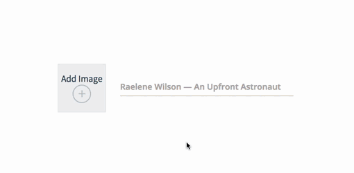
- Upfront cropping: Better than the existing WordPress cropping experience.

Dimensions will display in the top-left corner so you can resize resize your image to your desired height and width.

If you hover over the image, further options for cropping, linking and adding a caption will display, as well as image settings for adding alt text.

Clicking the crop option will also give you the option to change and replace the current image.

### Gallery

The gallery elements allows you to display, well, a gallery.

Once you’ve added your images, there are lots of options for basic styling in the element settings.

- **Label sorting:** When turned on, a “tag” icon will appear in the settings for each individual image. When you add labels to your images, they will then display at the top of the gallery.
- **Thumbnail Ratio:** Choose from one of the three default ratios (1:1, 2:3 or 4:3) or stick with your theme’s default ratio.
- **Thumbnail Size:** Drag the range slider to adjust the size of your images. Dimensions will display below so you can keep your sizes in check.
- **Thumbnail Padding:** Drag the slider again to adjust the padding between images. If you check “Even padding” underneath, Upfront will automatically add the same padding around all images in the gallery.
- **Caption Settings:** Add captions over images, under images or not at all.

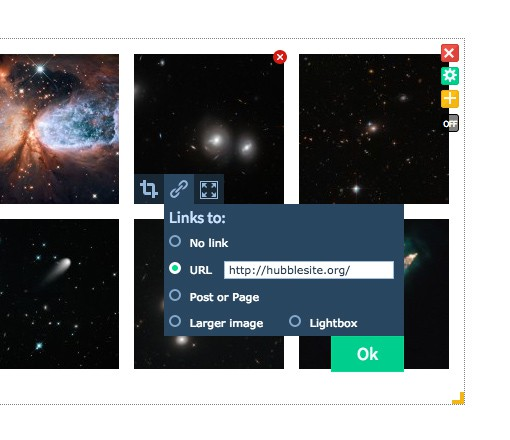
- Using the Gallery element

To re-order the images, switch the “On/Off” button underneath the settings cog to “On” and then click and drag them where you like. When switched off, you can move the images around.

Like the Image element, there are settings for individual gallery images so you can replace and crop them. You can also link to other posts, pages or sites, or even larger versions or a lightbox.

### Map

If you’ve ever spent ages setting up a map on your site, you’ll be blown away by how easy it is to do with Upfront.

All you need to do is drag across the map element, enter an address (or use your current location), and hit enter. The map will update with your location.

You can update the map in the settings:

- **Map Location:** Enter a new address to update the map.
- **Map Zoom Level:** Use the range slider to zoom in and out of your location.
- **Map Style:** Change the default roadmap style to satellite, hybrid or terrain.
- **Map Controls:** Enable pan, zoom, map type, scale, street view and overview map to display.
- **Draggable map:** Turn this on if you want users to be able to click and drag the map.
- **Hide markers:** Hide the red pin that marks the map location.

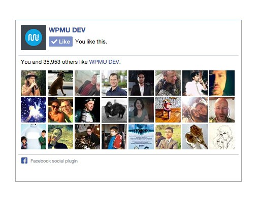
- Using the Like Box element

### Like Box

Or should I say, Facebook Like Box. This one’s easy – just drag the element to your site, enter the URL for your Facebook page and hit enter. The element will update to show all of your Facebook friends.

The larger you resize the Like Box, the more Facebook users you can display on your site.

### YouTube

Whether you want to add just one video or a list of videos, the YouTube element does it all.

When you drag across the element, it will prompt you to pick either multiple videos or a single video. Pick one and then fill out the settings.

### Single Video

- **Video URL:** Enter your URL.
- **Title:** Enter how many characters you would like to display for the title.
- **Description:** Enter a maximum number of characters to display for the description.

### Multiple Videos

- **Gallery or List:** Choose how you would like to display your videos.
- **User Channel or Playlist:** Choose one and enter your YouTube username or Channel ID.
- **Display Latest Videos:** Choose how many videos you would like to display.
- **Title:** Enter a maximum number of characters for the title
- **Description:** Enter a maximum number of characters for the description. This option will not be available if you have selected the List option.
- **Thumbnail size:** Drag and slider across to resize the video images.

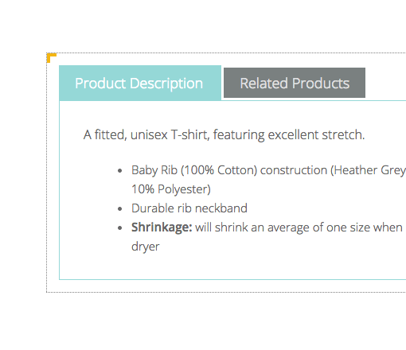
- Using the Tabs element.

### Tabs

If you want to display more content in less space, tabs provide a slick solution. The basic tabs element comes with basic styling. Adding your own styling is easy and there are options for editing the active, hover and static states of the table titles. You can even style tabs with custom CSS, but we’ll look at how to add custom code to your site in-depth in the next post in this series.

### Widget

There’s no such thing as widgetized areas in Upfront because your whole site is widgetized. This means you can place widgets anywhere you like on your site. Pretty cool, huh?

After you drag the widget element onto your site go to the settings to select a widget. You can access any of the default WordPress widgets, such as pages, calendar and archives, or choose any other widget created by your plugins.

For example, say you want to display a basic contact form using our Contact Widget. All you need to do is install and activate the plugin, then open your site in Upfront and drag and widget element where you would like to display a form. Select Contact Form in the drop down list and click OK. All done!

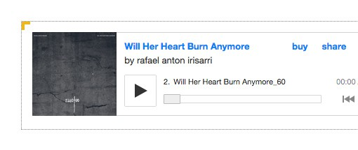
Add a Bandcamp music player to your site using the Code element.

### Code
The Code element goes some way to showing off the power of Upfront. when you drag and element across, you can choose to “Embed 3rd Party code” or “Write Custom Code.”
 
The embedding code option is designed to allow you to add embed code from sites like Bandcamp, Twitter and SoundCloud.

The custom code option is for advanced users who want to code their own element for their site. Say, for example, you want to feature an image of your cat on your site that, when clicked, plays meow.mp3. You can do that with the Code element.

Needless to say, there are more useful ways you could take advantage of the Code element. You could create a “back to top” button or even a custom product carousel.

### Login

With the Login element, you can place a login form anywhere on your site. When you drag across the element, it displays as a form by default, but in the settings you can change this to a dropdown if you don’t want the login to take up too much space on your site. You can also change the text for the login button and display a logout link.

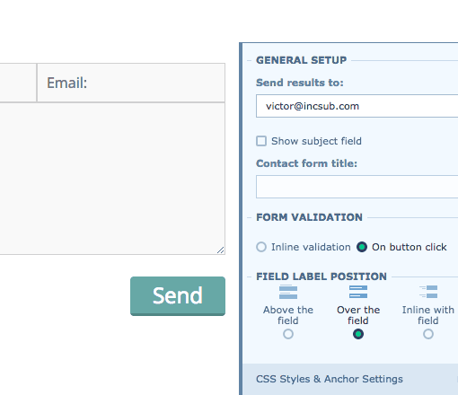
- Set up a simple email form using the Contact element.

### Contact

The Contact element lets you display a simple form with name, email and message fields.

In the settings you can enter the email address you would like messages sent to. You can also choose to show the subject field on the form. You can also choose inline or on-button click validation, as well as where you would like the field label to be positioned.

### Menu

The menu element lets you display your menus anywhere, just drag the element across and choose the menu you would like to display.

There are some really cool styling options that come with this element:

- **Burger menu:** Instead of a horizontal menu you can add a burger menu to your site. You can choose to display it left, right, at the top of your page or over the whole of your page. You can also choose to display the menu over your content or push your content to the side.
- **Menu Item Alignment:** Align the menu left, center or right.
- **Behavior Settings:** You can choose to auto-update menus when new pages are added, and also enable floating menus. Floating menus are a great option if you just want your navigation to float, rather than an entire region.

It’s worth mentioning that the Menu element is completely integrated with WordPress menus, which means you can work with, and display, multiple menus on your site.

### Accordion

Much like the Tabs element, the Accordion element is a great option if you want to display a lot of content in a small space.

It comes with a basic preset style, depending on the default theme you’re using, but you can always create your own custom present style in the settings.

### Button

Whether you want to add a link to another page on your site or a link where users can download a product, the Button element lets you create and style a button to match your site.

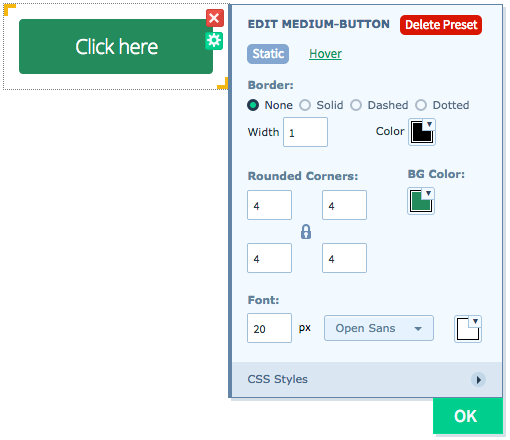
- Using the Button element

As with all elements, drag it where you want and a default button will display. You can double-click the button to edit the text, or go to the settings to select or create a button preset design.

When you edit a preset button design, you can change the border, add rounded corners, and select fonts and colors. There’s lots more you can do with custom CSS, but we’ll look at that in another post.

### Slider

With Upfront you can add sliders as regions, but also as elements. When you drag across the Slider element, you can choose to add a slider with images only, text over images, text below images or text on the side.

In the settings you can change the slider style if you change your mind. You can also change how quickly the images rotate, as well as how they transition (up, down, left, right or crossfade). The slider controls can also be turned on or off, or only show on hover.

### Posts

Last, but not least, the Posts element lets you display a single post or a list of posts. You can also choose whether to display an excerpt or a full post.

Now here’s the cool part: You can pick which parts of your posts you want to show, so if you just want to display just your post title, post content, and the date, you can do that. On top of that, you can also drag and drop the order of where you want each of those post parts to display, so you could choose to display your post title, the date, and then the content or switch up the order if you change your mind.

If you have the Post List option turned on, you can add pagination in the settings.

### Deleting Elements

Now that we’re familiar with Upfront’s elements, let’s get on with customizing Spirit.

Let’s start with deleting the elements we don’t need. To delete an element, simply hover over it and click the red “x” icon in the top-right corner.

I’m going to go ahead and delete the elements I don’t need, including the text element in the header, the text elements in the “About” section leftover from Spirit and the text elements in the footer.

### Inserting Elements

Now comes the fun part – adding new elements to our site!

To add an element – and as I’ve already mentioned – all you need to do is click and hold one of the elements in the Draggable Elements list and drag it onto your site.

I’m going to add the new elements I need for my site, including a logo, a text sub heading, button and images for the header region. Check out the GIF below to see the changes in action.

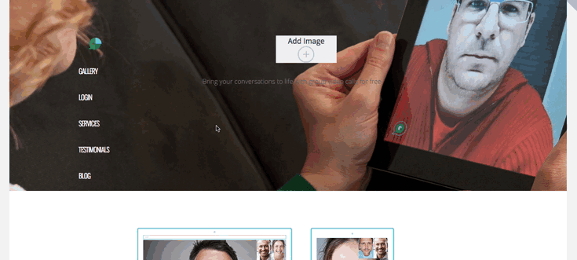

### Cloning Elements

If you have a layout with similarly sized elements, for example three text areas, you don’t need to create three separate text elements and style them individually. Instead, you can create just one text area and clone it.

To clone an element, right-click and select “Clone” in the dropdown. The cloned element will attach itself to the mouse cursor and will drop into place wherever you click.

When you create a clone, it will be an absolute clone, meaning every single aspect of the original element will be copied, resulting in an identical element you can then edit.

Using the cloning tool, I can quickly create the three text areas in the main area of the homepage.

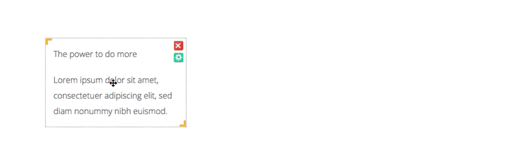

## Conclusion

Let’s recap what we’ve accomplished up to this point in putting together our new site:

- All off the elements in Spirit that we don’t need have been deleted.
- We’ve added and styled new text elements to the header, main body of the homepage and footer.
- The Spirit logo has been replaced with the new logo for our site.
- New buttons have been created and styled.
- We’ve also added new images to the header, main body of the homepage and the footer.

We’ve done a lot in this post! In the next article in this series, we’ll continue working on our new site, this time focusing on how to implement custom code to further customize the look and feel of our site.

**Read the next post in this series:** [Part 4: Tweaking Elements and Custom Code](https://cp-psource.github.io/upfront/tutorial-tweaking.html)

### How to Use Upfront Series:

- **Part 1:** [The Basics, Theme Colors and Typography](https://cp-psource.github.io/upfront/tutorial-basics.html)
- **Part 2:** [Structuring Your Site with Regions](https://cp-psource.github.io/upfront/tutorial-regions.html)
- **Part 3:** [Laying Out Your Site with Elements](https://cp-psource.github.io/upfront/tutorial-elements.html)
- **Part 4:** [Tweaking Elements and Custom Code](https://cp-psource.github.io/upfront/tutorial-tweaking.html)
- **Part 5:** [Adding Plugins and Styling Gravity Forms](https://cp-psource.github.io/upfront/tutorial-plugins.html)
- **Part 6:** [Creating Responsive Websites](https://cp-psource.github.io/upfront/tutorial-responsive.html)
- **Part 7:** [Working with Pages and Posts](https://cp-psource.github.io/upfront/tutorial-content.html)