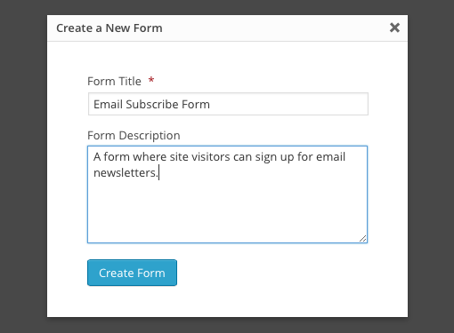

# UPFRONT PART 5: ADDING PLUGINS AND STYLING GRAVITY FORMS

## Adding plugins to a site using Upfront isn’t any different to adding plugins to a site using any other theme.

The only difference is that with Upfront it’s even easier to style front-end plugin content with custom CSS and you can even do it with live preview. Cool, huh?

In today’s post, we’re going to set up an email subscribe form using Gravity Forms. I’ll also show you how to set up and style our Appointments + plugin in Upfront.

This is the fifth post in our series introducing how to use Upfront. We’re adapting an existing Upfront theme – in this case Spirit – and turning it into a completely different site, complete with its own branding, images, custom fonts and responsive layout.

### Over the course of this series we will use lots of examples to show you how to use Upfront:

- **Part 1:** [The Basics, Theme Colors and Typography](https://cp-psource.github.io/upfront/tutorial-basics.html)
- **Part 2:** [Structuring Your Site with Regions](https://cp-psource.github.io/upfront/tutorial-regions.html)
- **Part 3:** [Laying Out Your Site with Elements](https://cp-psource.github.io/upfront/tutorial-elements.html)
- **Part 4:** [Tweaking Elements and Custom Code](https://cp-psource.github.io/upfront/tutorial-tweaking.html)
- **Part 5:** [Adding Plugins and Styling Gravity Forms](https://cp-psource.github.io/upfront/tutorial-plugins.html)
- **Part 6:** [Creating Responsive Websites](https://cp-psource.github.io/upfront/tutorial-responsive.html)
- **Part 7:** [Working with Pages and Posts](https://cp-psource.github.io/upfront/tutorial-content.html)

We’re taking the Spirit theme and completely reworking its regions and content, and turning it into a product theme, complete with its own branding, colors, buttons, images, typography, newsletter subscribe form and other elements.

So far in this series, we’ve updated theme colors, added custom fonts, deleted regions, updated the header image and added a full width video region. Here’s a look at our progress so far:

* On the left, our progress. On the right, what we’re working towards building.

## Setting Up a Subscribe Form with Gravity Forms

My new design features an email subscribe form at the bottom of the homepage, which I want to set up with [Gravity Forms](https://www.gravityforms.com/), the most popular premium WordPress forms plugin.

It’s pretty basic. All it needs is a one-line text area, placeholder text and a button since its job is to collect email addresses.

Creating a new form with Gravity Forms is easy:

* Styling Gravity Forms

Go to Forms > New Form to create a new form.

A modal will pop up asking you to name your form and give it a description.

Go ahead and fill out these details. Your users won’t see what you write here – these details only display in the backend of your site so it’s for your eyes only.

On the Form Editor page, go to the “Advanced Fields” dropdown and select “Email.”

*Styling Gravity Forms

In the “General” tab for your form, leave the “Field Label” and “Description” sections empty. In the “Appearance” tab, enter some placeholder text. I’m going to enter “Enter your email for exclusive news.”

Click “Update Form” and you’re done setting up the form.
Next, we need to switch to Upfront to style the form on the front-end.

Drag a Widget element onto your site where you would like to display the newsletter subscribe form. In the element settings, select “Form” from the dropdown, then select your form from the “Select a Form” dropdown, and enable AJAX. The un-styled form will display. It doesn’t look very nice… yet.

We’re going to style the form with custom CSS. One of Upfront’s truly impressive features is live preview. This means when we add CSS to the form we can see the changes happen straight away without having to save and refresh. Very cool!

Click on “CSS & Anchor Settings” in the element settings for the form, and then click “add new style.”

A code editor will appear at the bottom of the screen where you can enter your CSS.

Copy and paste the following code to style the form:

<pre>
.gform_widget * {
    margin:0;
    padding:0;
}
.gform_fields li {
    list-style:none;
}
.gform_body {
    width:75%;
}
.gform_footer.top_label {
    width:25%;
}
.gform_body, .gform_footer.top_label {
    margin:0;
    display:inline-block;
    margin:0 -2px;
}
.gform_footer input[type=submit] {
    background-color: #ufc3;
    color: #ffffff;
    padding:11px 30px;
    font: 14px Open Sans;
    border-radius: 0 3px 3px 0;
    margin-right:0;
    width:100%;
}
.gform_wrapper input[type=text] {
    padding:10px;
    font: 14px Open Sans;
    border-radius: 3px 0 0 3px;
    border:1px solid #ufc7;
    width:100%;
}
.gform_wrapper ::-webkit-input-placeholder,
.gform_wrapper :-moz-placeholder,
.gform_wrapper :-ms-input-placeholder {
   color: #ufc7;
}
.gform_confirmation_message {
    border:1px solid #ufc7;
    padding:15px;
    background:#fff;
    color:#ufc3;
}
</pre>

What’s we’re doing is changing the color and font of the button (`gform_footer input[type=submit]`) and adding rounded corners.

We’re also styling the placeholder text, giving the text area a border and aligning the text area and button so they sit flush.

*Styling Gravity Forms

Here’s what the styled subscribe form looks like with the custom CSS.

With its green button and styled placeholder text, it now matches the design of the rest of the site.

It’s also worth noting that when the element is resized, so too is the width of the text area so you can make it as wide as you like.

It’s important that we also style the confirmation message that displays after a user submits an email address. Here’s the CSS to do that:

<pre>
.gform_confirmation_message {
    border:1px solid #ufc7;
    padding:15px;
    background:#fff;
    color:#ufc3;
}
</pre>

You may also want to style any other error messages, such as notifications when a user tries to enter an incorrect email address, i.e. one doesn’t contain an “@“ symbol.

The subscribe form looks great, right?

Of course, this is a fairly basic integration with Upfront. You may also want to add the Gravity Forms MailChimp add-on so that email addresses you collect are saved to your MailChimp account.

## Setting Up Appointments+ in Upfront

Since my site is fairly basic and doesn’t require many plugins that display content on the front-end. I’m going to deviate for the rest of this post and show you how to  set up and style one of our plugins – [Appointments +](https://cp-psource.github.io/terminmanager-pro/).

 
Appointments + is a powerful bookings plugin and best of all it’s easy to set up. Styling, like with any plugin, does take a bit of extra effort.

Setting Up Appointments+

I’m going to set up a basic bookings form for a hair salon that offers cuts, color, and blow dry, and has two staff members.

First up, install and activate Appointments+. The easiest way to do this is to use our WPMU DEV Dashboards plugin if you don’t already have it installed.

A top-level menu item will appear in the backend of your install and after initially installing the plugin tooltips will appear to help you set it up.

In the Settings, I’m going to leave the time base as 60 minutes.

* Custom colors for the front-end appointments calendar.

I’m also going to create my own custom color set using my theme colors.

Next, I need to add services and hair stylists.

Filling out the services is easy – just give each a name, a duration and a price. You can also specify a description page for each service. You’ll need to create a new page for each service if you want use this option.

Before adding new employees, you need to add each staff member as a new user to the backend of your site. Once you’ve done that, simply select each employee from the dropdown box, assign their services and choose a bio page. Like services, you’ll need to create a new page for each person if you haven’t done so already).

The only other setting I need to worry about it Working Hours. In this example scenario, my salon is open from 9am-5pm weekdays and has two staff members, Emma and Jane. Emma only works from 9am-12pm. In the Working Hours tab, I can set her working hours.

## Styling Appointments +

Now that we’ve got Appointments + all set up and ready to go, we need to style the front-end. This include the calendar, services list, service providers list, and booking confirmation message.

Now that Appointments+ is all set up, let’s go about styling the front-end calendar, services list, service providers list, and booking confirmation message.

In order to match my site’s new design, we need to update the fonts to use Open Sans, and style the calendar and buttons to match our new theme colors.

To do this, drag a new Widget element onto your site and in the settings select “Text.” In the main text area, paste in the following shortcode:

I’ve put the shortcodes into a table for easy formatting.

Next, click on “CSS Styles & Anchor Settings” at the bottom of the element settings window and then click “add new style.”

In the code editor that appears at the bottom of the screen, paste in the following CSS:

With the custom CSS in place, here’s what my appointments calendar looks like on the front-end:

## Conclusion

In this post we’ve learned how to add and style plugins in Upfront. Specifically, we added a simple email subscribe form using Gravity Forms to our site. We also add a bookings calendar – just for fun – using Appointments +.

Styling plugins, such as Gravity Forms and Appointments +, takes time with any theme, but with Upfront adding custom code is not only easy but also cool to see with live preview. No longer do you have to go back and forth, saving changes you’ve made in the theme editor. Now you can see changes as you make them.

As I mentioned in this article, Upfront hasn’t quite reached version 1.0 but our developer team is currently working as quickly as humanly possible to resolve compatibility with popular plugins.

Read the next post in this series: **Part 6:** [Creating Responsive Websites](https://cp-psource.github.io/upfront/tutorial-responsive.html)

### How to Use Upfront Series:

- **Part 1:** [The Basics, Theme Colors and Typography](https://cp-psource.github.io/upfront/tutorial-basics.html)
- **Part 2:** [Structuring Your Site with Regions](https://cp-psource.github.io/upfront/tutorial-regions.html)
- **Part 3:** [Laying Out Your Site with Elements](https://cp-psource.github.io/upfront/tutorial-elements.html)
- **Part 4:** [Tweaking Elements and Custom Code](https://cp-psource.github.io/upfront/tutorial-tweaking.html)
- **Part 5:** [Adding Plugins and Styling Gravity Forms](https://cp-psource.github.io/upfront/tutorial-plugins.html)
- **Part 6:** [Creating Responsive Websites](https://cp-psource.github.io/upfront/tutorial-responsive.html)
- **Part 7:** [Working with Pages and Posts](https://cp-psource.github.io/upfront/tutorial-content.html)