# Upfront Part 2: Structuring Your Site with Regions

## When it comes to laying out a site with Upfront, regions provide the building blocks you need to create everything from fullscreen and full width headers to contained sections, sidebars and footers.

Regions form the background on top of which everything else – images and text, video and sliders – can be built.

In today’s post we’ll look at how to delete and insert regions, the various types of regions available, and global headers and footers.

This is the second post in our series introducing how to use Upfront. We’re adapting an existing Upfront theme – in this case Spirit – and turning it into a completely different site, complete with its own branding, images, custom fonts and responsive layout.

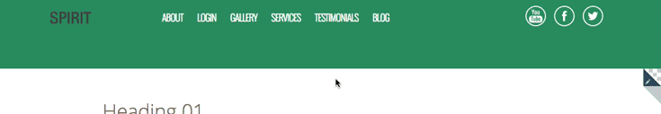

### Over the course of this series we will use lots of examples to show you how to use Upfront:
Part 1: The Basics, Theme Colors and Typography
Part 2: Structuring Your Site with Regions
Part 3: Laying Out Your Site with Elements
Part 4: Tweaking Elements and Custom Code
Part 5: Adding Plugins and Styling Gravity Forms
Part 6: Creating Responsive Websites
Part 7: Working with Pages and Posts
We’re taking the Spirit theme and completely reworking its regions, content, typography and other elements, and turning it into a product theme, complete with its own branding, colors, typography, buttons, images, contact form and other elements.

In the last post in this series, we updated theme colors, typography and added custom fonts. Here’s a look at our progress so far:

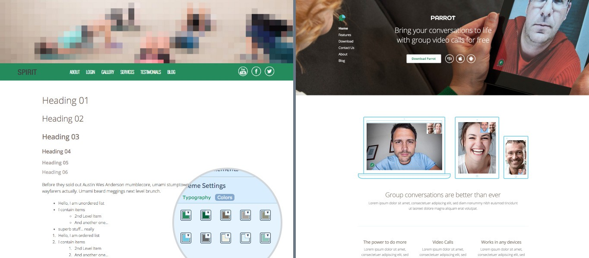

On the left, our progress. On the right, what we’re working towards building.

## Deleting Regions

Let’s start again with deleting stuff.

Spirit features a homepage with a beautiful, long design with 14 regions, including the header, sections for different services, a newsletter subscription form and a footer.

My new site design’s homepage only requires four regions: A header image, a section explaining the app I want to advertise, a full width video and a footer.

So we’ll need to delete a few regions.

As you scroll through Spirit, a small pen icon will appear in the top-right corner of each region.

When you click on the icon, the page will transform to show you a few different options.

In the top left-hand corner, the region’s dimensions will be displayed
In the top right-hand corner there’s a red “x” icon (for deleting a region), and underneath that a green cog icon (region settings)
There are also yellow “+” icons to the top, left, right and bottom of the page (for inserting a new region)
Lastly, a green “Finish editing background” option will display (for saving changes to the region)

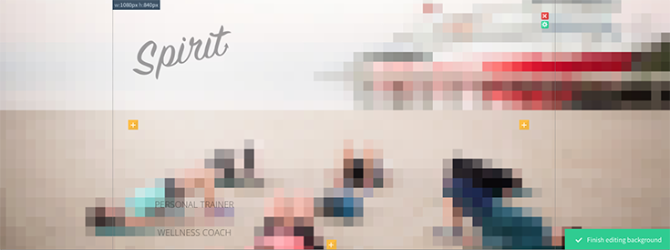

We want to delete 10 regions. We’ll keep the header and the navigation regions, so let’s start with the region after that, the “About” region. Click the pen icon and then click the red “x” icon. You’ll get a prompt asking if you’re sure you want to delete this section. Click “OK.” We’ll also keep the region after the navigation, but delete all the other regions except the footer.

It’s important to keep in mind that when you delete a region, ALL of its content will also be deleted, so it’s not something you want to do willy nilly!

## Inserting Regions

Creating a new region is simple. All you need to do is click the pen icon on an existing region and then click one of the yellow “+” icons at the top or bottom of the page. This will insert a new region above or below the region you have open.

The focus will swap to the new region and if you click on the green cog icon you’ll be able to customize how it looks.

There are a bunch of different types of regions you can use to build your site. Let’s go through them all.

Fullscreen region settings

## Fullscreen

Only header regions allow a fullscreen option. As the name implies, this region fills the entire browser screen from top to bottom and left to right.

This is a great option if you want to use a hero image as your header, or even create a landing page that fills the entire browser window and doesn’t scroll.

This type of region provides two further options:

## Add Navigation Region

This is essentially a sub-region, which allows you to display navigation within the header region. What’s great about this option is that when users access your site, they will be able to see your navigation displayed “above the fold” in their browser window.

The default is no navigation, or show it at the top or bottom of the region.

## Element Behavior

You can choose your fullscreen header to “Keep Position” or “Keep Ratio.”

Keep Position means any logos, text, images, buttons etc. will remain where they are when a user resizes their browser window.

Keep Ratio means those same elements will automatically adjust their position when a user resizes their browser window. For example, if your logo is smack bang in the middle of the region, it will vertically adjust its position when the browser window is resized. This is a handy option for this very reason!

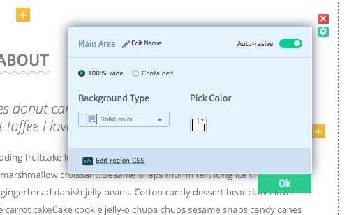
100% Wide region settings

## 100% Wide

Display regions full width left to right, but not top to bottom.

Use this type of region if you don’t want your header to fill the browser window, but need it to display full width. We’ll look at options for setting the vertical height of regions below.

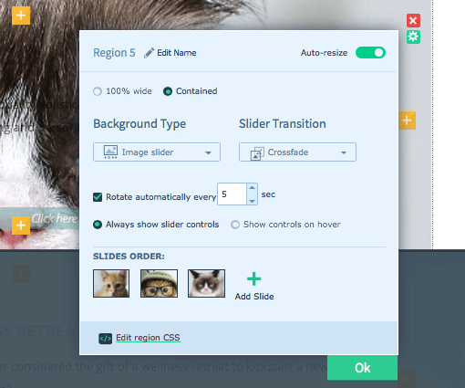
Contained region settings

## Contained

The Contained option allows you to letterbox your site.

You can control the container width by going to Theme Settings and clicking on Edit Global Background.

You can also change the global background type to a solid color, image or even video to display across your whole site.

Background Types
You don’t have to settle for boring colors for your backgrounds. Upfront allows you to have:

Solid Color – OK, well you can have colors if you want, but they don’t have to be boring! Add your own hexadecimal code or use the color picker.
Image – When you upload an image, you can specify it’s positioning (full width, tiled/pattern or fixed). If you choose the fixed option, you can even specify the image’s exact X and Y positioning. Talk about precise!
Video – Add a video as a background
Image Slider – Easily add a slider any number of images, specify.
Map – This option uses Google Maps, so all you need to do it enter an address, select your zoom, choose a may style (roadmap, satellite, hybrid, or terrain), and check which controls you want to also display (pan, map type, scale, street view, overview map).
Now that we know how to update the header image, let’s go ahead and do that:

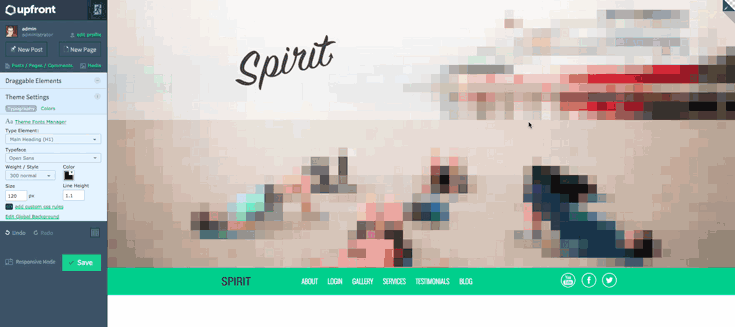

We’ll also go ahead and add a video as a region background.

Upload a video from popular services, including YouTube, Vimeo and Wistia. There are also options for how video is scaled and cropped, mute on play, and the ability to play video on pageload.

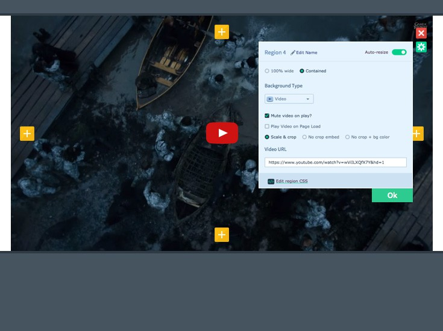

## Other Region Settings

Now that we’ve covered the main stuff, let’s look at other region options that help make life easier.

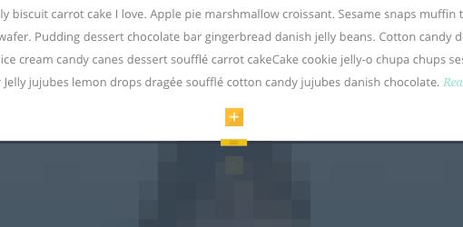
Auto-resizing regions

## Auto-resize

The 100% Wide and Contained regions provide an auto-resize option. The best way to explain how it works is with a scenario: Let’s say I created a region that was 400px high. If I turned auto-resize off, Upfront would not allow that region to automatically re-size if I tried to stack more elements that the region’s height. But if I turned auto-resize on and then tried to either stack elements or insert an element taller than the region, the region would automatically update to the require height.

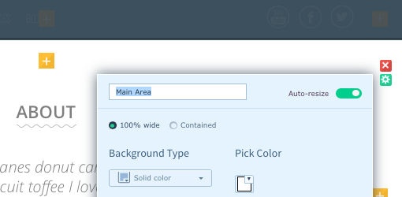
Name regions for consistency

## Naming Regions
You can name regions in the settings for pure convenience! I should also add that when you name a region is passes that name as an ID, which is handy if you want to play with custom CSS. We’ll look at this in an upcoming post.

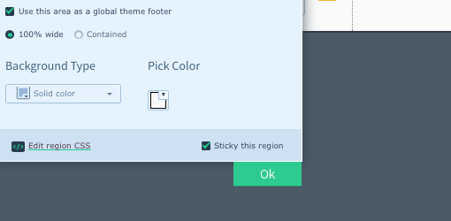
Add sticky regions, such as navigation

## Sticky Regions

You can make regions “stick,” which is particularly helpful if you want to add navigation that is always visible on a page. Note that it’s only possible to make one region sticky at a time.

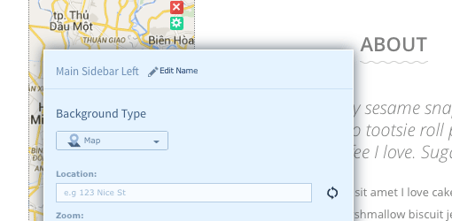
Add sidebars to your site where you want them

## Sidebars

Just as you would add a new region, click the left and right yellow “+” icons to create sidebars. In the settings, you can then choose a background type, along with the full width, tiled/pattern, and fixed position image variations.

## Global Regions

Using global regions is a neat way to display the same header or footer, or even both, across your site, saving you from having to duplicate your content.

Upfront automatically recognizes the top and bottom regions on your site as the header and footer, so when you open the settings for these regions, the “Use this area as a global footer” option will appear.

## Conclusion

So again, let’s recap what we’ve accomplished so far in putting together our new site:

We’ve deleted a bunch of regions to reshape the layout of our site
We’ve updated the header region to display our own image
We’ve added a full width video
In the next post in this series, we’ll continue working on our new site, this time focusing on how to lay out the site with elements, such as images, text and buttons.

Read the next post in this series: Part 3: Laying Out Your Site with Elements

If you have any questions about what we’ve covered in this post, feel free to ask away in the comments below.

How to Use Upfront Series:
Part 1: The Basics, Theme Colors and Typography
Part 2: Structuring Your Site with Regions
Part 3: Laying Out Your Site with Elements
Part 4: Tweaking Elements and Custom Code
Part 5: Adding Plugins and Styling Gravity Forms
Part 6: Creating Responsive Websites
Part 7: Working with Pages and Posts