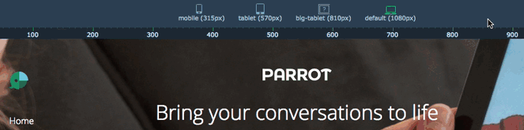
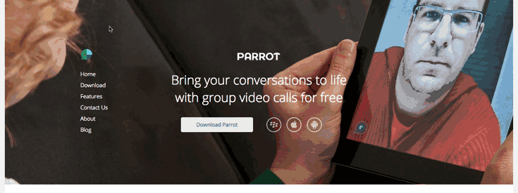
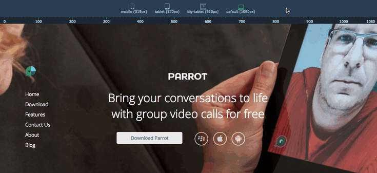
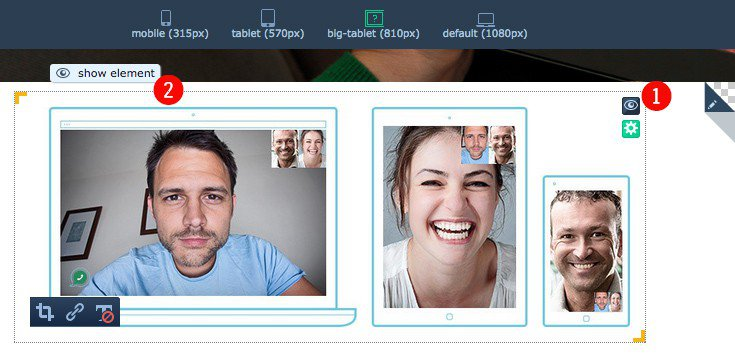
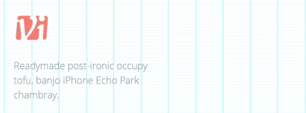

# UPFRONT PART 6: CREATING RESPONSIVE WEBSITES

## Responsive web design, according to Wikipedia, is an approach aimed at crafting sites to provide an optimal viewing experience – easy reading and navigation with a minimum of resizing, panning, and scrolling – across a wide range of devices, from desktop computers to mobile phones.

Likewise, the responsive mode in Upfront aims to provide a seamless experience for users viewing a site, but more importantly for people who want to create a responsive site with ease that looks fantastic on any device.

In today’s post, we’re going to update the layout of our site for mobile devices. I’ll also explain some of the thinking behind how we designed the responsive mode in Upfront.

This is the sixth post in our series introducing how to use Upfront. We’re adapting an existing Upfront theme – in this case Spirit – and turning it into a completely different site, complete with its own branding, images, custom fonts and responsive layout.

### Over the course of this series we will use lots of examples to show you how to use Upfront:

- **Part 1:** [The Basics, Theme Colors and Typography](https://cp-psource.github.io/upfront/tutorial-basics.html)
- **Part 2:** [Structuring Your Site with Regions](https://cp-psource.github.io/upfront/tutorial-regions.html)
- **Part 3:** [Laying Out Your Site with Elements](https://cp-psource.github.io/upfront/tutorial-elements.html)
- **Part 4:** [Tweaking Elements and Custom Code](https://cp-psource.github.io/upfront/tutorial-tweaking.html)
- **Part 5:** [Adding Plugins and Styling Gravity Forms](https://cp-psource.github.io/upfront/tutorial-plugins.html)
- **Part 6:** [Creating Responsive Websites](https://cp-psource.github.io/upfront/tutorial-responsive.html)
- **Part 7:** [Working with Pages and Posts](https://cp-psource.github.io/upfront/tutorial-content.html)

We’re taking the Spirit theme and completely reworking its regions and content, and turning it into a product theme, complete with its own branding, colors, buttons, images, typography, newsletter subscribe form and other elements.

So far in this series, we’ve updated theme colors, added custom fonts, deleted regions, updated the header image, added a full width video region, and created and style a newsletter subscribe form using Gravity Forms. Here’s a scroll through our progress so far:

## Designing a Responsive Site

Before we get stuck into updating the responsive layout for our site, let’s pause for a moment to think about how we want the site to look on different devices.

Do we need all of the regions? What about the elements? Do we need all of those, too? Should the site look the same on both mobile and desktop? What about tablet devices?

Do we need the video region to display on mobile phones?

These are all important considerations because, more often than not, how a site displays on a desktop computer won’t naturally translate to the small screen of a mobile device. It makes sense to cut back on regions and elements you don’t need to ensure your content loads quickly on smaller devices.

## Using Upfront’s Responsive Mode

Entering Responsive Mode in Upfront is as simple as clicking the Responsive Mode button in the sidebar.

There are four devices you can update your layout for: **mobile (315px), tablet (570px), big-tablet (810px)** and **default (1080px)**.

If you don’t want to update your layout for all these devices, you don’t have to. You can choose the ones you prefer to update in the Activate Breakpoints dropdown.

I’m going to update my site for mobile devices for this articles, so I’ll only activate the Mobile breakpoint. Then I need to select the mobile option at the top of the page

Now that’s done, let’s start updating the mobile layout.

### Updating Typography

It’s a good idea to begin with typography. The typography options for Upfront will automatically display in the sidebar when you enter responsive mode, allowing you to update the desired sizes for each of your type elements, H1, H2, P etc.

Some type elements like H1 may look good on the desktop version of my site, but on mobile it’s way too big, so I’ll change it to a smaller size.

### Hiding, Resizing and Arranging Elements

Remember when I said earlier to consider what you want to display on mobile devices? Now’s the time to hide any elements you don’t need.

A cool feature of responsive mode in Upfront is the ability to hide elements and even entire regions that you don’t want to display.  These regions and elements won’t be deleted, but will display, well, hide.

To toggle the show/hide mode, just hover over an element and click the blue eye icon that displays in the top-right. When you hide something, the other regions and elements on your site will automatically realign to fill the empty space.

In the image above, 1 indicates where the hide icon is for elements. In order to hide/show regions, you need to click on the region pen icon (also in the top-right) and the eye icon will display there.
 
Number 2 points to where an element has been hidden. In order to display  an element on your site, just click “show element” and it will reappear.

It’s worth nothing that in responsive mode you can move elements around within a region, but you can’t move elements from one region to another. You also can’t delete or add new elements to your. To do this, you’ll need to exit responsive mode and edit the desktop version of your site. Also, you can only change the background color of a regions and not add, say, a video or an image.

Why all the restrictions? Well, it all comes down to good design and ensuring there’s a consistent look across your site. After all, it makes sense that the mobile version of your site should resemble the desktop version, rather than look like a completely different site with elements placed in different sections of your homepage and regions with different backgrounds.

You should also rearrange any elements that aren’t aligned properly, like your logo in the header, any navigation or images.

At this point, I’m going to take a detour to explain…

### Working With Complex Content

Content in Upfront will automatically `float:left` in responsive mode. Content is not added to your site using `position:absolute` like some other page builders like Wix, for example. If you’re familiar with CSS you know what I’m talking about. If you’re not, basically this means you can’t go placing elements anywhere on your site willy nilly.

Upfront works like this: The logic is that once you enter responsive mode it attempts to resize and position your site’s elements so that they look, well, OK.

This means that once you enter responsive mode there is less work for you to do. You just need to take what’s there and improve it, i.e. rearrange images and text, maybe hide elements and other content.

The float property in CSS treats elements on the page as rows. This means that if the height of the following element exceeds that of the proceeding element then it will be forced onto the next line, or row.

* Aligning images.

In the GIF on the left, at first it seems impossible to position the button in the middle of the image and text elements. However, that behavior can be overcome by first grouping elements on the left.

This is an important tip to remember when laying out elements in Upfront.

Why did we create responsive design in Upfront to work this way? To provide a better user experience on responsive devices. If we didn’t do things this way there would be elements overlaying other elements in a confused mess. Basically, it would look like a dog’s breakfast.

We’re currently working on improving this behavior so stay tuned for improvements in a future version of Upfront.

## Update Responsiveness on Other Pages in Your Site

It’s also possible to adjust the layout of your content on other pages besides your homepage.

The Browse Layouts dropdown box in the sidebar lists other pages on your site you can update. Just select the page you want to work with and make the updates you want.

To return to working on your homepage, click on the Upfront icon in the top-left.

## Conclusion

In this post we’ve learned how to create responsive designs in Upfront. Specifically, we’ve updated the layout for our site so it looks great both on desktop computers and mobile devices.

Upfront provides a seamless experience for users viewing a site on any device, but more importantly it makes it easy for people to quickly create a responsive site with just a few adjustments to their original site.

Read the next post in this series: **Part 7:** [Working with Pages and Posts](https://cp-psource.github.io/upfront/tutorial-content.html)

### How to Use Upfront Series:

- **Part 1:** [The Basics, Theme Colors and Typography](https://cp-psource.github.io/upfront/tutorial-basics.html)
- **Part 2:** [Structuring Your Site with Regions](https://cp-psource.github.io/upfront/tutorial-regions.html)
- **Part 3:** [Laying Out Your Site with Elements](https://cp-psource.github.io/upfront/tutorial-elements.html)
- **Part 4:** [Tweaking Elements and Custom Code](https://cp-psource.github.io/upfront/tutorial-tweaking.html)
- **Part 5:** [Adding Plugins and Styling Gravity Forms](https://cp-psource.github.io/upfront/tutorial-plugins.html)
- **Part 6:** [Creating Responsive Websites](https://cp-psource.github.io/upfront/tutorial-responsive.html)
- **Part 7:** [Working with Pages and Posts](https://cp-psource.github.io/upfront/tutorial-content.html)