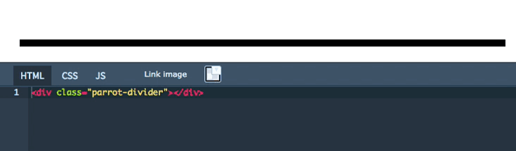
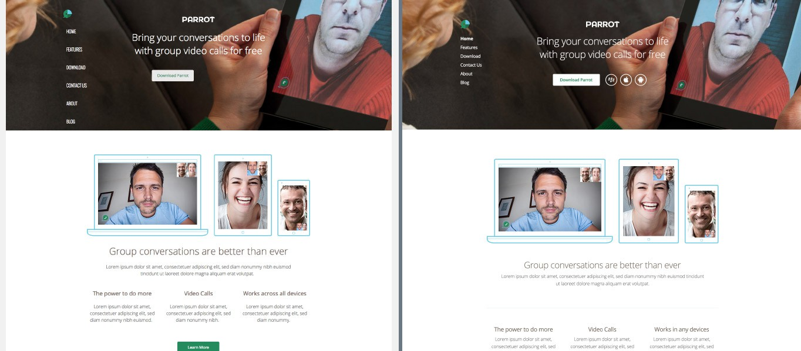

# Upfront Part 4: Tweaking Elements with Custom Code

## Sometimes, what elements provide by default just isn’t enough. Maybe you want to add extra shine to your slider, or perhaps the style of your site suggests that the tabs element could really do with a texture for its background?

Today I’m going to show you how to create your own re-usable Upfront element styles, and provide code snippets for you to make modifications of your own.

You will see how Upfront completely transforms the experience of modifying the CSS of your themes by placing it in context, and dynamically updating the layouts to reflect your changes. It makes the experience of augmenting your theme with CSS astonishingly easy by providing direct feedback on your input.

This is the fourth post in our series introducing how to use Upfront. We’re adapting an existing Upfront theme – in this case Spirit – and turning it into a completely different site, complete with its own branding, images, custom fonts and responsive layout.

### Over the course of this series we will use lots of examples to show you how to use Upfront:

- **Part 1:** [The Basics, Theme Colors and Typography](https://cp-psource.github.io/upfront/tutorial-basics.html)
- **Part 2:** [Structuring Your Site with Regions](https://cp-psource.github.io/upfront/tutorial-regions.html)
- **Part 3:** [Laying Out Your Site with Elements](https://cp-psource.github.io/upfront/tutorial-elements.html)
- **Part 4:** [Tweaking Elements and Custom Code](https://cp-psource.github.io/upfront/tutorial-tweaking.html)
- **Part 5:** [Adding Plugins and Styling Gravity Forms](https://cp-psource.github.io/upfront/tutorial-plugins.html)
- **Part 6:** [Creating Responsive Websites](https://cp-psource.github.io/upfront/tutorial-responsive.html)
- **Part 7:** [Working with Pages and Posts](https://cp-psource.github.io/upfront/tutorial-content.html)

We’re taking the Spirit theme and completely reworking its regions and content, and turning it into a product theme, complete with its own branding, colors, buttons, images, typography, newsletter subscribe form and other elements.

So far in this series, we’ve updated theme colors, added custom fonts, deleted regions, updated the header image and added a full width video region. Here’s a look at our progress so far:

- On the left, our progress. On the right, what we’re working towards building.

## Tweaking Elements with Custom CSS

Let’s start with enhancing some of our existing theme styles (two blockquotes and link styles) using the Code element to create a horizontal divider, and then add some animated transitions to our button, image captions and gallery thumbnails.

In this post I’ll use non-prefixed CSS properties for clarity/ease-of-use. I strongly recommend that you use a service like [Pleeease](https://pleeease.iamvdo.me/play/) to generate prefixes automatically and make sure your code is compatible across browsers. Just paste your un-prefixed code into the left panel and copy the result from the right panel.

## Enhancing Our Global Typography

Up to this point in this Upfront series we’ve been limited to altering our typography via **Theme Settings > Typography**.

Usually, that’s enough to get the basic typographic structure sorted. But we want to take things further. Currently, our blockquotes are using the fonts and colors that we want, but the “double quote” icon that is used in the Spirit theme remains.

Let’s create our own blockquote styles using some custom CSS. Click on **add custom css rules** in the **Theme Settings > Typography** sidebar. This will bring up a code panel at the bottom of your screen with additional CSS rules that are used in Spirit. Lines 12 to 34 are responsible for styling blockquotes. Let’s delete them and add our own code:

<pre>
blockquote {
    background:#ufc3;
    padding:30px;
    border-radius:5px;
    position:relative;
    margin:20px 0 40px;
}
blockquote.upfront-quote-alternative {
    background:none;
    border-left:3px solid #ufc3;
    border-radius:0;
    padding:5px 15px;
    margin-left:15px;
}
blockquote.upfront-quote-alternative:before, blockquote.upfront-quote-alternative:after {
    display:none;
}
</pre>

This is pretty straight-forward CSS, but what is that #ufc3 thingy? That’s not a valid hexadecimal color you would say, and you would be absolutely right.

In fact, #ufc3 is a built-in Upfront variable. This allows me to use Theme Colors that we defined in the first article in this series within the Code element.

Color variables begin with 0 and go to 9, so to refer to the first theme color you defined, you would use #ufc0, #ufc1 for the second theme color and so on. The rest of the code is pretty common. Upfront comes with two blockquote styles; we are using the blockquote selector to style the first one, and blockquote.upfront-quote-alternative for the alternative blockquote style.

Now, I am going to show you a little CSS trick to make our first blockquote look a bit more like a speech bubble. Add the following code to your blockquote styles:

blockquote:after {
    content:'';
    width: 0;
    height: 0;
    border: 0 solid transparent;
    border-left-width: 9px;
    border-right-width: 0px;
    border-top: 10px solid #ufc3;
    position:absolute;
    bottom:-10px;
    left:45px;
}
view rawupfront-blockquote-speech.css hosted with ❤ by GitHub
Here we are using :after, which is a pseudo-element, and it’s an extremely powerful tool in your CSS arsenal. There’s a superb article by Chris Coyier (who you really should follow on Twitter) about cool things you can do with pseudo elements.

Blockquote styling
Well, now that we have styled our blockquotes, let’s add some code to make our inline links a bit more interesting:

Style One
/* border bottom grows into box */

p a {
     position:relative;
}
p a:after {
     content:'';
     height:2px;
     width:100%;
     background-color:#ufc2;
     position:absolute;
     left:0;
     bottom:0;
     z-index:-1;
     transition:height .1s linear;
     opacity:.2;
}
p a:hover:after {
     height:100%;
}
view rawupfront-blockquote-style-1.css hosted with ❤ by GitHub
Style Two
Style Three
Style Four
Below is an example of each of the four additional link styles in action. Choose the one you like and add it to your global CSS.

As you can see, with just a few lines of code the default typography can be significantly enhanced.

The great thing about having this kind extensibility is that it allows you to implement other people’s code and use it on your own site. Here’s a great site I found with some inspiring inline-link styling examples.

Customizing Upfront Elements
Just like global typography, Upfront allows you to dig a little deeper and and customize the appearance of elements and to save your modifications as a re-usable style that you can then apply to elements of the same type anywhere on your site.

Let’s explore this further by creating an animated button style.

Drag a new Button Element onto your site, and then go into the Settings and create a new preset. I am calling mine NoFill.

Let’s give this button a 3px wide border, and select one of our theme colors for it (I have gone with the green, which for me happens to be #ufc0). I have also made the background transparent and given button text the same color we used before.

For the hover state, I have kept all values the same, but made the button text white. Now before proceeding further, let’s click OK and save the layout (always remember to save your progress!).

Now at this stage all we have is a button that changes its text color on hover. Let’s add the magic. Go into the settings and the pre-set you have just created should be selected. Open up CSS Styles & Anchor Settings panel at the bottom of the settings dialogue, then click add new style. This will bring up a familiar code panel at the bottom of the browser. You will notice that unlike the Global Theme CSS panel, this one has the Available element selectors: section on the left. This section is there on for all elements and it is designed to help you with styling by giving CSS selectors for that element.

Sign up for more
WordPress wisdom	
Enter your email...
 
Once again, I won’t go into the details here, just add the code in the snippet below to your code panel, give the style a name (I have gone for “hover-effect”) and click Save.

Now hover over your button and you will see that it now has an animated effect. Pretty cool, huh? If you are not getting the color you have selected for the border you can adjust it in the code (line 8, background-color:#ufc0;) to your desired color variable or any color in general.

Image caption hover
Adding an Animation to the Image Element Caption
Let’s try animating a caption.

Add an Image element to your layout and either upload a new image or choose something from the media manager.

Next, hover over the image to get an additional panel, and click the third option, Caption Position, and select the fourth option, Covers Image Middle. Now add some text in there, a few lines will do. The caption’s background color can be modified by going into the element settings. You can also set it to only show caption “On Hover,” though for now I recommend leaving it as is so we can see what we are doing while we’re adding code to it (besides, the code we add will make sure that the caption is only visible on hover).

Go into the CSS styles panel, create a new style and add the code from the snippet below:

Now save your style (I called mine “caption-transform”) and again, save the layout. You should be able to see it in action when you hover over the image. Not bad, huh?

You will notice that we have not used any colors in the CSS, meaning that you can still change the caption background and text colors via the element settings and text editing experience. This means you can have a bunch of different colored captions that will use this behavior.

You will notice that I have offset my caption to begin 10px above and to the left of the image itself. This was my stylistic preference. If you would prefer to have the caption placed directly over the image, you need to modify line 10 transform:translate(-10px,-10px); to look like transform:translate(0px,0px);.

Note: Don’t forget to run that CSS through the pre-fixing app I mentioned before. I usually write my CSS un-prefixed in Upfront and once I am happy with the result, I’ll run it through the app. I find that to be the most efficient way to ensure my CSS is correct.

Adding Subtle Effects to the Gallery Element
I want my thumbnails to be a little less opaque by default and to gain 100% opacity and zoom as I hover over them.

I have named my style “gallery-hover” and added the following CSS:

And here’s what adding the code looks like in action using Upfront:

Gallery customization
Styling the navigation to match our theme design.
In the previous post in this series (Upfront: Laying Out Your Site with Elements), we changed the appearance of the navigation in the header to a vertical layout, but didn’t go further into customizing it.

I have created a new style for my navigation called parrot-main-nav and added the following CSS to match my design:

I have only added a very simple color change on hover, but from the examples I provided before, I am sure you are inspired to experiment!

It is worth noting that we do plan to add a basic, code-less experience to allow users to pick colors for their navigation (in similar way to the Text or Tabs elements) in the near future.

The Code Element
Lastly, I would like to briefly mention the Code element. In our design, we have very subtle, one line dividers. These can be accomplished in a number of ways, including using images, or setting border-bottom to the preceding element. However, I think the easiest way is to use the Code element and build them ourselves.

To do this, add a Code element to your layout and select the Write Custom Code option. You will notice that the code panel provided now has HTML, CSS & JS options. This means that you can add quite a lot of completely custom functionality to Upfront, provided that you can code.

In later articles, I will discuss some potential ways of using the Code element to extend the capabilities of your themes. For now, though, I am keeping it simple and only using HTML and CSS panels. In your HTML panel, add the following code:

And then add this to your CSS panel (choosing your own color):

Click Save on the code panel, close it and save your layout. You can right-click on the Code element and clone it if you require more dividers in your layout.

Conclusion
In this post we’ve learned that anything in Upfront can be subverted with just a few lines of CSS. I’ve also demonstrated the flexibility of the platform and the great benefits of live code editing that Upfront brings.

We’ve also learned how to add CSS animations to the Gallery, Image and Button elements, experimented with styling of links and blockquotes and built our own divider using Code Element.

Upfront can be a great companion to anyone learning how to code, however, if you know your way around there are virtually no limits to what you can accomplish.

Read the next post in this series: Part 5: Adding Plugins and Styling Gravity Forms

If you have any questions about what we’ve covered in this post, feel free to ask away in the comments below.

### How to Use Upfront Series:

- **Part 1:** [The Basics, Theme Colors and Typography](https://cp-psource.github.io/upfront/tutorial-basics.html)
- **Part 2:** [Structuring Your Site with Regions](https://cp-psource.github.io/upfront/tutorial-regions.html)
- **Part 3:** [Laying Out Your Site with Elements](https://cp-psource.github.io/upfront/tutorial-elements.html)
- **Part 4:** [Tweaking Elements and Custom Code](https://cp-psource.github.io/upfront/tutorial-tweaking.html)
- **Part 5:** [Adding Plugins and Styling Gravity Forms](https://cp-psource.github.io/upfront/tutorial-plugins.html)
- **Part 6:** [Creating Responsive Websites](https://cp-psource.github.io/upfront/tutorial-responsive.html)
- **Part 7:** [Working with Pages and Posts](https://cp-psource.github.io/upfront/tutorial-content.html)